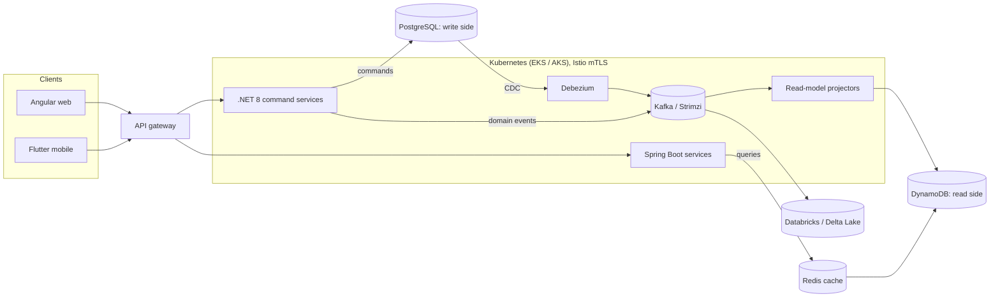
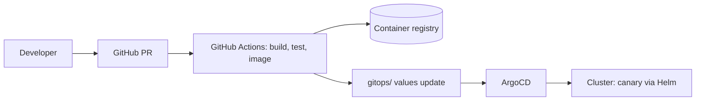

# Project 1: system context and data flow

Diagrams are Mermaid text so they diff in Git and render on GitHub.

```mermaid
flowchart LR
  subgraph Clients
    web[Angular web]
    mobile[Flutter mobile]
  end
  gw[API gateway]
  subgraph K8s["Kubernetes (EKS / AKS), Istio mTLS"]
    dotnet[.NET 8 command services]
    java[Spring Boot services]
    proj[Read-model projectors]
    kafka[(Kafka / Strimzi)]
    dbz[Debezium]
  end
  pg[(PostgreSQL: write side)]
  redis[(Redis cache)]
  ddb[(DynamoDB: read side)]
  lake[(Databricks / Delta Lake)]

  web --> gw
  mobile --> gw
  gw --> dotnet
  gw --> java
  dotnet -->|commands| pg
  pg -->|CDC| dbz --> kafka
  dotnet -->|domain events| kafka
  kafka --> proj --> ddb
  java -->|queries| redis --> ddb
  kafka --> lake
```

## Delivery flow

```mermaid
flowchart LR
  dev[Developer] --> gh[GitHub PR]
  gh --> ci[GitHub Actions: build, test, image]
  ci --> reg[(Container registry)]
  ci --> repo[gitops/ values update]
  repo --> argo[ArgoCD]
  argo --> k8s[Cluster: canary via Helm]
```
