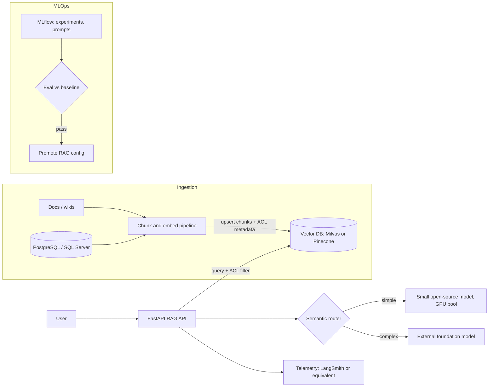

# Project 2: RAG engine context and data flow

```mermaid
flowchart LR
  user[User] --> api[FastAPI RAG API]
  api --> router{Semantic router}
  router -->|simple| small[Small open-source model, GPU pool]
  router -->|complex| ext[External foundation model]
  api -->|query + ACL filter| vec[(Vector DB: Milvus or Pinecone)]
  api --> obs[Telemetry: LangSmith or equivalent]

  subgraph Ingestion
    src1[Docs / wikis] --> proc[Chunk and embed pipeline]
    src2[(PostgreSQL / SQL Server)] --> proc
    proc -->|upsert chunks + ACL metadata| vec
  end

  subgraph MLOps
    mlf[MLflow: experiments, prompts] --> gate{Eval vs baseline}
    gate -->|pass| prod[Promote RAG config]
  end
```
